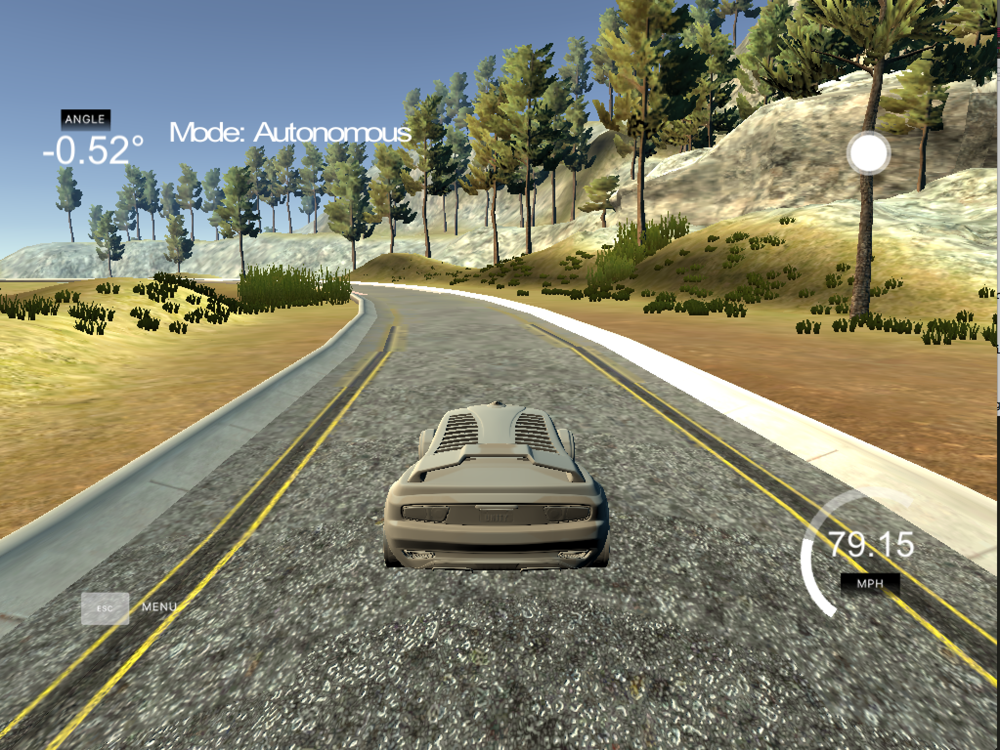
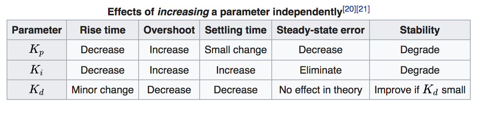
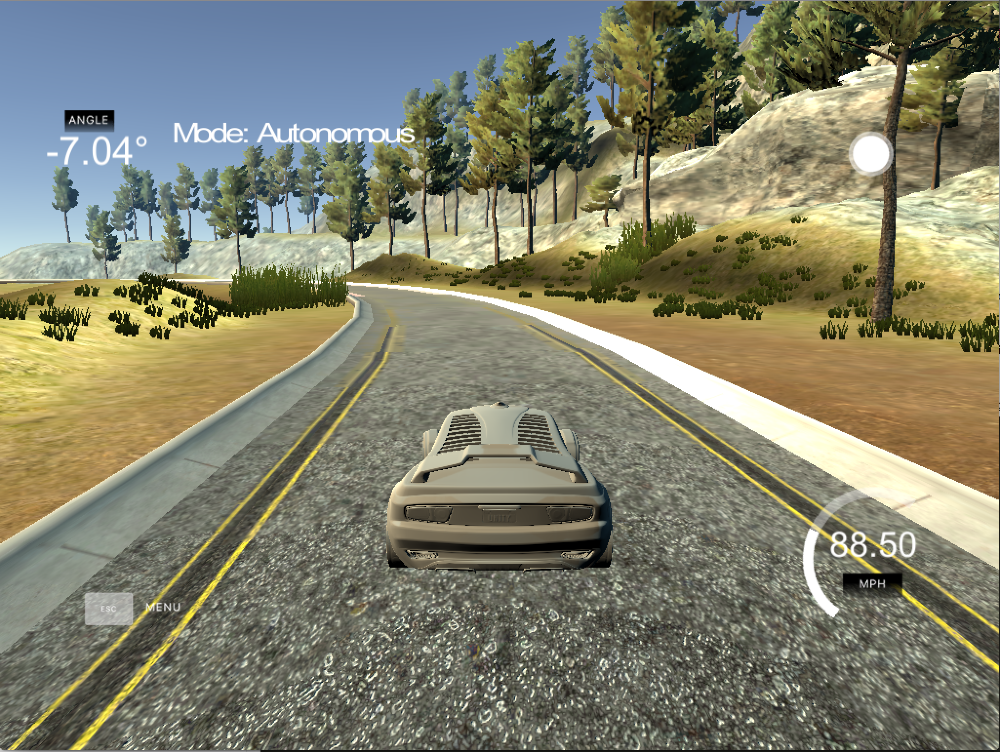

# CarND-Controls-PID
Self-Driving Car Engineer Nanodegree Program

---

## Basic Build Instructions

1. Clone this repo.
2. Make a build directory: `mkdir build && cd build`
3. Compile: `cmake .. && make`
4. Run it: `./pid`. 

Tips for setting up your environment can be found [here](https://classroom.udacity.com/nanodegrees/nd013/parts/40f38239-66b6-46ec-ae68-03afd8a601c8/modules/0949fca6-b379-42af-a919-ee50aa304e6a/lessons/f758c44c-5e40-4e01-93b5-1a82aa4e044f/concepts/23d376c7-0195-4276-bdf0-e02f1f3c665d)

## About the project

We have a car in a circuit, wich we can drive by sending throttle and steering and we receive the speed and error (called cte), as the difference between the center of the road and the center of the vehicle.

Taking this error as cte we make:

proportional error=cte

derivative error=previous cte-cte

integral error=integral error+cte

And finally

total error= Kp*proportional error+Ki*integral error+Kd* derivative error

And this total error will be the quantity to decrease to the steering wheel.

After that, we have to tune Kp, Ki and Kd.

If we only use Kp

we will have some zigzag driving, till we are out of the road.

If we only use Ki

we will have a first turn and then another one that will bring us out of the road.

If we only use Kd

we will have a better driving at the beggining, but when we reach the first curve we will be out of the road.

But if we mix the three values together we can reach a good solution.

## How to get the result
As noted in wikipedia https://en.wikipedia.org/wiki/PID_controller

You can probe each of the values to get a final result.

I had tried to implement Twiddle, but I understand that you must begin from the beggining each time, so you should stop and start the simulator, so I have tried another method, but without success.

Finally, by manual tunning I get the following parameters:

Kp | Ki | Kd
--- | --- | ---
*0.1* | *0.008* | *5*

## What about the speed
In the first try, I only want to make the car drive through the circuit and let it give a lot of laps.

After that, I probed some speeds, some works, some not, but after that, I suppouse that I can send less throttle if we have much error and more throttle if we have a small error.

So finally I implementend something like:
abs(0.9-2.5*abs(steer_value))
And I have give laps without going out of the road with the top speed of 88 MPH:

## Weird behaviours

After get the high speed succesfully, I began to write this readme.

Then I tried to record some videos, and then I had some problems.

If I try to record a video with the same computer that was running the sinulation, then the car was out of the road.

For instance. This car gives 2 laps, and then goes out:

but if you leave it without recording, it can be 
forever into the road.

And now, just like a outtake, we have a weird behaviour, where a car was working good, and then made that in the recording.

